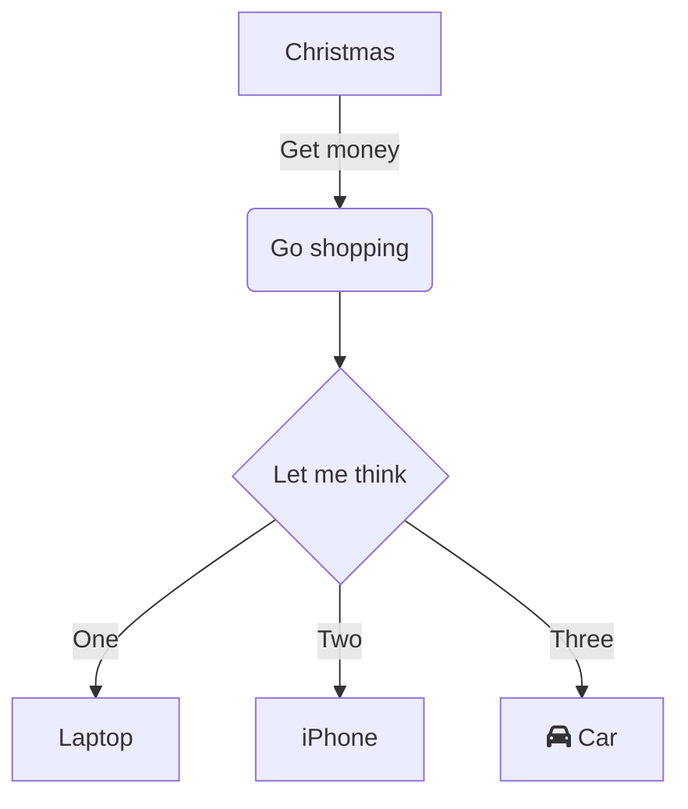

# mermaid-markdown-example
This repository has examples of how GitHub implicitly handles Mermaid markdown codeblocks and directly converts them into their appropriate charts/diagrams. 

Write the following code in your README (or any `.md` document):

```
\`\`\`mermaid
# Mermaid code goes here
\`\`\`
```

Example:

```
\`\`\`mermaid
flowchart TD
    A[Christmas] -->|Get money| B(Go shopping)
    B --> C{Let me think}
    C -->|One| D[Laptop]
    C -->|Two| E[iPhone]
    C -->|Three| F[fa:fa-car Car]
\`\`\`
```


