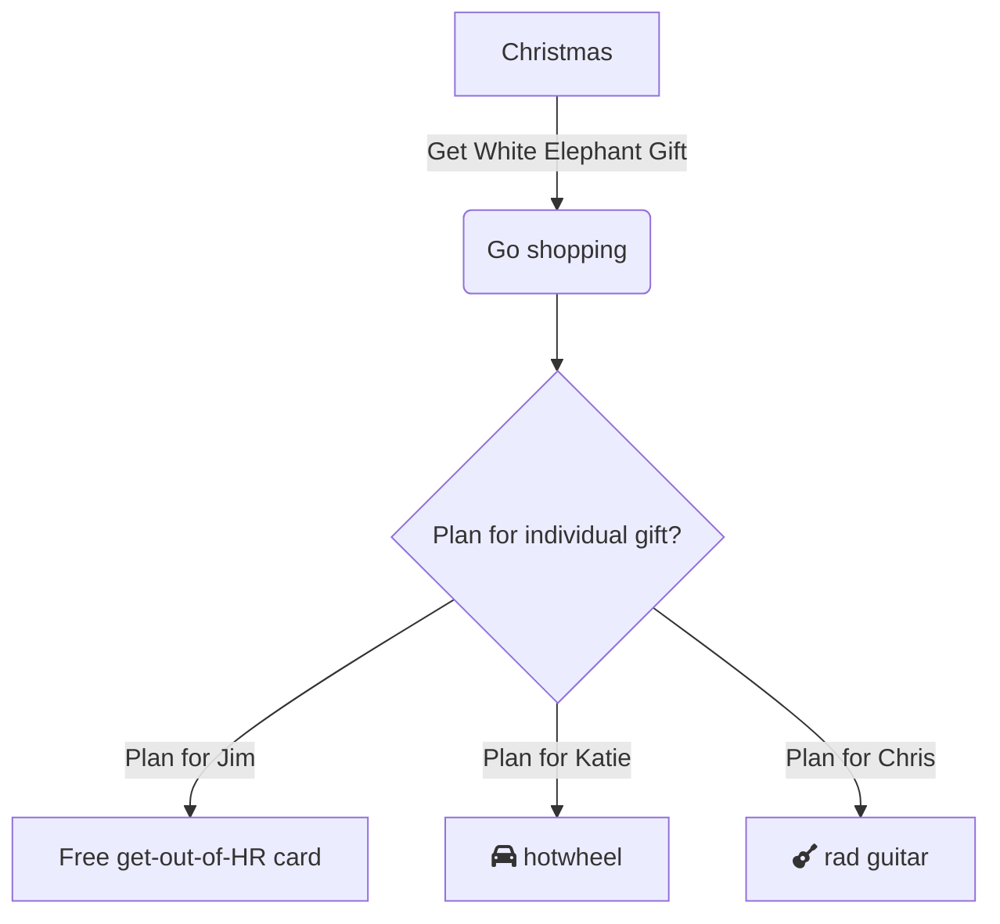
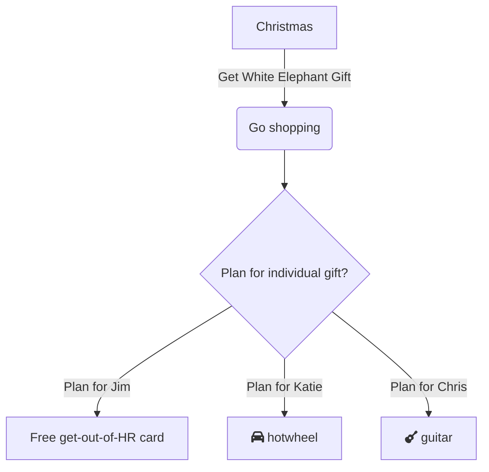

# mermaid-markdown-example
This repository has examples of how GitHub implicitly handles Mermaid markdown codeblocks and directly converts them into their appropriate charts/diagrams. 

Write the following code in your README (or any `.md` document):

````
```mermaid
# Mermaid code goes here
```
````

Example:

````

````


