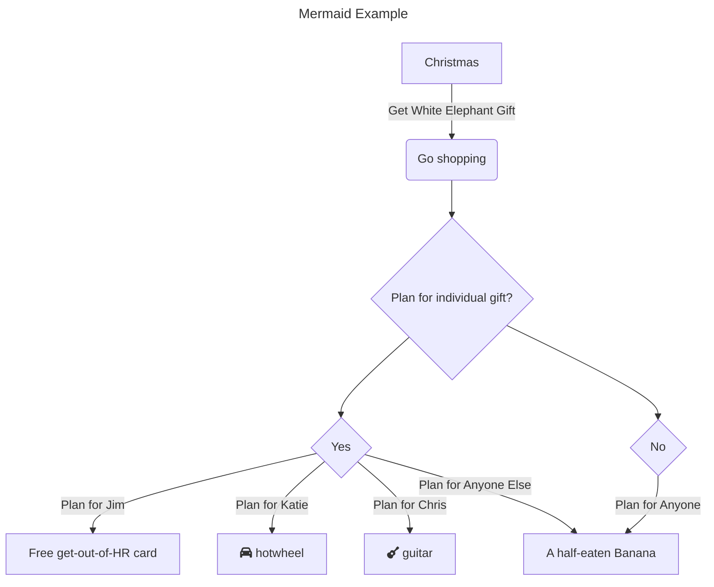

# mermaid-markdown-example
This repository has examples of how GitHub implicitly handles Mermaid markdown codeblocks and directly converts them into their appropriate charts/diagrams. 

Write the following code in your README (or any `.md` document):

````
```mermaid
# Mermaid code goes here
```
````

Example:

````
```mermaid
---
format: revealjs
---
title: Mermaid Example
---
flowchart TD
    A[Christmas] -->|Get White Elephant Gift| B(Go shopping)
    B --> C{Plan for individual gift?}
    C --> D{Yes}
    C --> H{No}
    D -->|Plan for Jim| E[Free get-out-of-HR card]
    D -->|Plan for Katie| F[fa:fa-car hotwheel]
    D -->|Plan for Chris| G[fa:fa-guitar guitar]
    D -->|Plan for Anyone Else| I
    H -->|Plan for Anyone| I[A half-eaten Banana]
```
````



# Important Notes

GitHub Markdown Diagrams do not easily handle custom icons. There are some that can be handled (such as GCP, AWS, or Azure icons) but others like FontAwesome aren't easily handled. Read more on this [here](https://github.com/orgs/community/discussions/11940)
